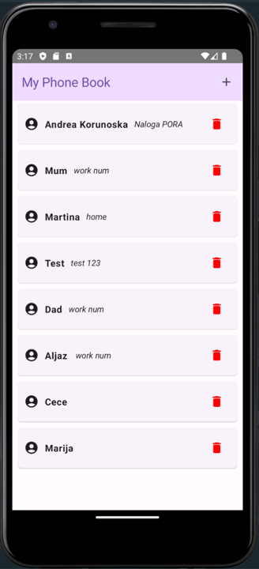
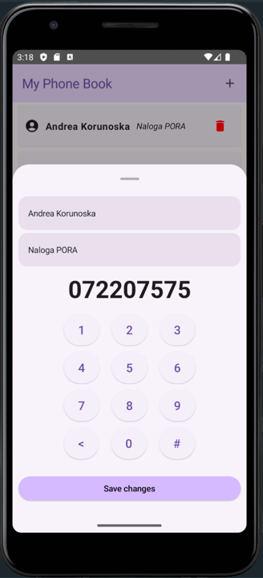
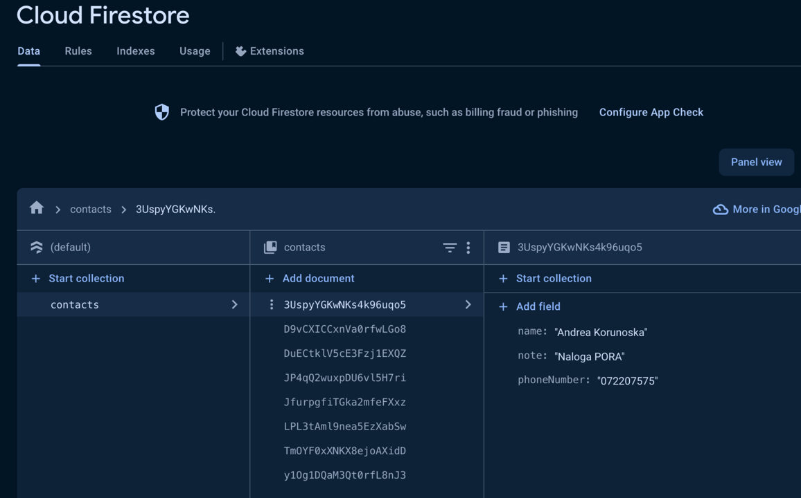
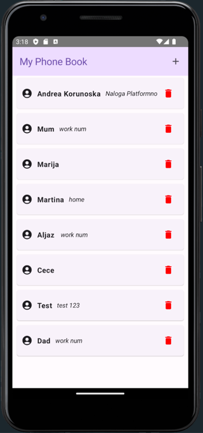
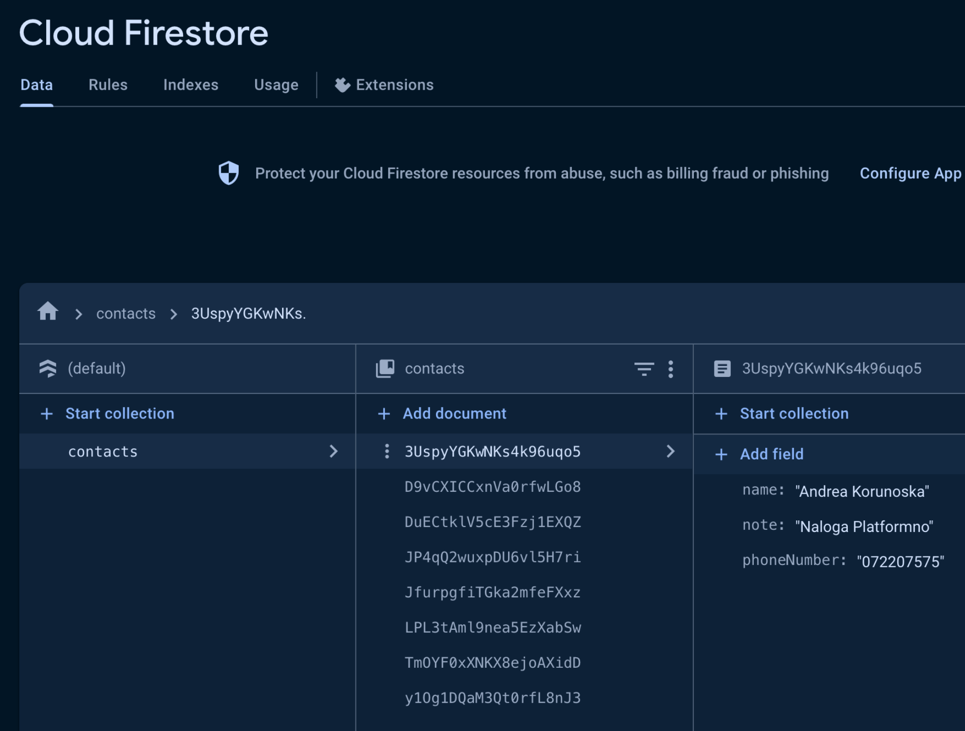

# [Firebase Firestore](https://firebase.google.com/docs/firestore)
**Firebase Firestore** je oblak-based, prilagodljiv, in razširljiv podatkovni sistem, ki je del Firebase platforme, ki jo upravlja Google.
Je prilagodljiva, razširljiva podatkovna baza za mobilni, spletni, in strežniški razvoj iz Firebase in Google Cloud storitev.
Podobno kot Firebase Realtime Database ohranja sinhronizacijo podatkov med klientovimi aplikacijami s pomočjo poslušalcev v realnem času in zagotavlja brezhibno delovanje brez povezave na mobilnih napravah in na spletu.
S tem omogoča ustvarjanje odzivnih aplikacij, ki delujejo ne glede na omrežno latenco ali internetno povezljivost.
Cloud Firestore prav tako omogoča brezhibno integracijo z drugimi izdelki Firebase in Google Cloud, vključno z oblakovo funkcionalnostjo.

Firebase Firestore lahko vključite v vaš projekt prek programa Android Studio (Orodja -> Firebase -> Cloud Firestore) ali s sledenjem korakom dokumentacije.

## Zakaj Cloud Firestore?

Cloud Firestore ima ključne sposobnosti, kot so:
1. **Prilagodljivost:** Shranjujte podatke v dokumentih, organiziranih v zbirke. Dokumenti lahko vsebujejo kompleksne gnezdene objekte poleg podzbirk.

2. **Izrazito poizvedovanje:** Uporabljajte poizvedbe za pridobivanje posameznih, določenih dokumentov ali za pridobivanje vseh dokumentov v zbirki, ki se ujemajo s parametri vaše poizvedbe. Poizvedbe lahko vključujejo več zaporednih filtrov in združujejo filtriranje ter razvrščanje. Privzeto so tudi indeksirane, zato je učinkovitost poizvedbe sorazmerna s velikostjo rezultatnega nabora, ne pa vašega podatkovnega nabora.

3. **Posodobitve v realnem času:** Kot pri storitvi Realtime Database uporablja Cloud Firestore sinhronizacijo podatkov za posodabljanje podatkov na kateri koli povezani napravi. Kljub temu je zasnovan tudi za učinkovito izvajanje preprostih / enokratnih poizvedb.

4. **Podpora brez povezave:** Cloud Firestore predpomni podatke, ki jih vaša aplikacija aktivno uporablja, tako da lahko aplikacija piše, bere, posluša, in poizveduje podatke tudi, ko je naprava brez povezave. Ko se naprava ponovno poveže, Cloud Firestore sinhronizira vse lokalne spremembe nazaj v storitev Cloud Firestore.

5. **Zasnovan za razširjanje:** Cloud Firestore prinaša najboljše iz močne infrastrukture storitve Google Cloud: samodejno razmnoževanje podatkov v več regijah, zagotovila močne doslednosti, atomski skupinski operacije, in pravo podporo za transakcije. Cloud Firestore smo zasnovali za obvladovanje najzahtevnejših obremenitev podatkovnih baz največjih aplikacij na svetu.

## Prednosti in slabosti

| PREDNOSTI :heavy_plus_sign:                                               | SLABOSTI :heavy_minus_sign:                                                                                                          |
|---------------------------------------------------------------------------|--------------------------------------------------------------------------------------------------------------------------------------|
| Realnočasno posodabljanje podatkov                                        | Cena                                                                                                                                 |
| Skalabilnost                                                              | Omejena kompleksnost poizvedb                                                                                                        |
| Enostavna integracija z drugimi storitvami Firebase                       | Omejitve indeksiranja                                                                                                                |
| Fleksibilna shema podatkov:                                               | Omejena podpora za transakcije                                                                                                       |
| Učinkovito iskanje in poizvedovanje                                       | Omejeno število povezanih podatkov v dokumentih                                                                                      |
| Vgrajena varnost                                                          | Omejitve glede velikosti dokumentov                                                                                                  |
| NEnostavna uporaba v mobilnih in spletnih aplikacijah                     | Odvisnost od storitve v oblaku                                                                                                       |

## [Licenca](https://github.com/firebase)
Apache 2.0 licenca in MIT licenca

## Zanimivi podatki

Po svetu je leta 2023 več kot 1.159 podjetij začelo uporabljati Google Cloud Firestore kot orodje za NoSQL podatkovne baze. Podjetja, ki uporabljajo Google Cloud Firestore za NoSQL podatkovne baze, so večinoma iz Združenih držav, kjer ima 421 strank.
Zadnja posoobitev je bila 2.1.2024 (Podpora za lokaciji europe-west1 (Belgija) in me-central2 (Dammam). Imajo redno posodabljanje - skoraj dvakrat mesečno.

## Gradle elementi

```gradle
plugins {
    id("com.google.gms.google-services")
}

dependencies {
    implementation(platform("com.google.firebase:firebase-bom:32.5.0"))
    implementation("com.google.firebase:firebase-firestore")
}
```

## Primer aplikacije 







